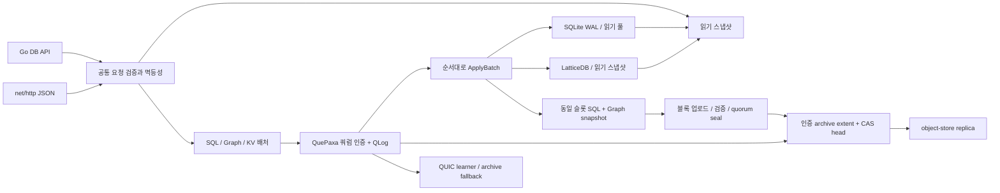

Rhiza 전체 평가 및 개선 설계·실행 계획 — 2026-09-05
================================================================

현재 Rhiza의 강점은 임베디드 API, 쿼럼 인증 로그, 재생 가능한 SQL·Graph 상태, 인증된 오브젝트 스토리지 복구를 하나의 Go 런타임으로 연결했다는 점이다. 개선의 첫 대상은 **Graph 메타데이터 복사, 유휴 복제본의 복구 핀 비용, 읽기·응답 메모리 admission, 지속 가능한 성능 측정**이다. 합의 알고리즘이나 SQL 엔진 교체를 먼저 할 근거는 없다.

이 문서는 분석과 설계 제안이다. 구현·배포·기본값 변경은 하지 않았다. 현재 코드에서 확인한 사실, 이번 로컬 측정, 과거 측정, 아직 검증되지 않은 가설을 구분한다. 추정 개선율·작업량·승인 목표는 제품 보장이나 이미 달성한 결과가 아니다.

평가 기준은 커밋 `f6c01b19ea6957a4dbdfd5636a7fdb5ffaad2c35`, Go 1.27.0, LatticeDB Go v0.3.0이다. 시작 시 작업 트리는 깨끗했고 `git fetch origin HEAD`로 원격 참조를 확인했다. Yeoul의 CGO 없는 통합 런타임, 임베디드 우선, async 기본값, 공개 ACK 전 쿼럼 인증 결정을 적용했다. 검색에 섞여 나온 과거 Rust 구현의 설명·측정은 현재 구현의 사실로 사용하지 않았다.

검토 범위는 루트 공개 API와 replica, CLI, network/QUIC, QuePaxa, QLog, materializer, checkpoint, archive, object provider/metrics, CI와 기존 벤치마크·E2E이다. 개별 의존성 전체를 감사하거나 실제 S3/GCS/Azure·운영 클러스터·물리 전원 장애를 시험한 것은 아니다. 아래 파일 링크는 이 작업을 수행한 로컬 체크아웃을 가리킨다.

| 평가 축 | 현재 장점 | 가장 중요한 약점 | 판단 근거 수준 |
|---|---|---|---|
| CPU | WAL group commit, SQL 배치, 읽기 풀, QUIC 연결 재사용 | Graph 쓰기마다 메타데이터 전체 맵 복사; JSON 검증·전송의 중복 직렬화 | Graph는 코드+프로파일 확인, JSON의 전체 성능 영향은 미측정 |
| 메모리 | 개별 결과·메시지·쓰기 큐 제한, bounded cache, 파일 기반 체크포인트 | 동시 읽기·전송의 총 보유량 제한 부재; Graph 할당 증폭; 미압축 consensus 상태 | 구조 확인, 최대 RSS는 미측정 |
| 레이턴시 | local/linearizable 분리, 작은 배치 대기, 제한된 proposal 병렬성 | 적용 직렬화, request-ID 잠금 대기, checkpoint/GC 경쟁, before-ack 원격 지연 | 구조 확인, 현재 3-voter p99 미측정 |
| 오브젝트 API | CAS·중복 회피·카운터·learner 대안 | 체크포인트 이후 no-op replica sync의 핀·GC lock 작업과 만료 핀 누적 | 실제 코드 경로 확인, 호출 수는 정적 모델 |
| 임베디드 API | context, typed 결과, SQL 트랜잭션·migration·precondition, 멱등성 | 설정·통계·읽기 mapper/페이지·replica API 표면 일부 부족 | 공개 API·테스트 확인 |
| HTTP | 표준 net/http, 엄격 JSON, body/header/timeout, 안정적 오류 코드 | 응답 메모리·읽기 fan-out admission과 서비스 지표 부족 | 코드 확인; 최신 네트워크 처리량 미측정 |
| 운영·복구 | 인증 checkpoint/로그, 원자적 교체, 격리·재생, 비투표 replica | 고정 membership, checkpoint 실패 시 WAL 압력, provider 검증 격차 | 코드·과거 qualification 확인 |

데이터 흐름은 다음과 같다. HTTP는 엔진 앞의 어댑터이고 임베디드 호출도 동일한 Server 서비스 로직으로 들어간다. SQL과 Graph를 함께 제공하지만 두 엔진을 임의로 섞은 하나의 공개 트랜잭션 API를 제공하는 것은 아니다.

쓰기 ACK의 핵심은 quorum 인증이다. `async`에서는 원격 게시가 ACK보다 늦을 수 있고, `before-ack`는 해당 슬롯의 원격 게시도 기다린다. local 읽기는 로컬 적용 상태를 읽으며, 여러 voter의 linearizable 읽기는 배리어를 거친다. 단일 voter의 read-index에는 별도 빠른 경로가 있다. `Ready`와 replica `LagSlots==0`은 현재 쿼럼의 최신 상태를 입증하지 않는다. 근거: [README](/Users/cypark/Documents/project/rhiza/README.md:65), [read-index](/Users/cypark/Documents/project/rhiza/pkg/quepaxa/core.go:312), [durability 연결](/Users/cypark/Documents/project/rhiza/pkg/node/node.go:290).

CPU·메모리를 판단하기 위해 현재 코드에서 수행한 측정은 다음과 같다. 환경은 Apple M3, darwin/arm64, 8 logical CPU, 24GiB, `GOMAXPROCS=4`이다. 500ms 자동 보정 벤치마크를 3회 실행한 중앙값이다. 공유 개발 호스트라서 전용 성능 장비의 결과가 아니며, 이전 커밋과 교차 실행한 A/B 결과도 아니다.

| 현재 마이크로벤치마크 | 중앙값 | 할당량 중앙값 | 측정 범위 |
|---|---:|---:|---|
| ServerQuery local | 2.616µs/op | 1,416 B/op, 40 allocs/op | 병렬 단일 voter, `SELECT 1`, Go 함수 직접 호출 |
| ServerQuery linearizable | 2.602µs/op | 1,416 B/op, 40 allocs/op | 단일 voter read-index fast path; 분산 배리어 아님 |
| GraphApply | 199.384µs/op | 296,357 B/op, 300 allocs/op | 성장하는 그래프에 단건 apply; 네트워크·합의 없음 |
| SQLBatchApply 1건 | 81.446µs/batch | 6,947 B/batch | 입력 구성·인코딩·materialize 포함 |
| SQLBatchApply 8건 | 169.493µs/batch | 33,381 B/batch | 건당 약 21.187µs |
| SQLBatchApply 64건 | 659.958µs/batch | 241,989 B/batch | 건당 약 10.312µs |
| SQLBatchApply 128건 | 1,262.238µs/batch | 484,839 B/batch | 건당 약 9.861µs; 현재 ingress batch 상한 확대 근거로 단독 사용 불가 |
| CheckpointFilesAt | 13.844ms/op | 99,930 B/op | 거의 빈 DB의 두 파일 backup; 클라우드 업로드 없음 |
| WALAppendSync | 2.970ms/op | 320 B/op | 로컬 256-byte payload append+fsync |
| WALScanScratch | 398.432µs/scan | 1,053,713 B/scan | 4KiB payload 256개 전체 scan |

병렬 benchmark의 ns/op는 전체 실행시간/완료 수이므로 개별 요청 레이턴시가 아니다. 특히 ServerQuery를 “HTTP 2.6µs” 또는 “3노드 linearizable 2.6µs”라고 표현하면 틀린다. GraphApply는 요청 수가 늘면서 데이터·receipt 수도 늘어나므로 고정 크기 DB의 정상상태 성능이 아니다. 원자료: [microbench.txt](/Users/cypark/Documents/project/rhiza/benchmarks/results/2026-09-05-architecture-audit/microbench.txt), [벤치마크 정의](/Users/cypark/Documents/project/rhiza/pkg/network/server_test.go:289), [SQL 배치 정의](/Users/cypark/Documents/project/rhiza/pkg/materializer/materializer_test.go:1234).

**Graph CPU·할당의 우선 개선 지점은 이미 측정으로 드러났다.** 별도 3초 GraphApply 프로파일의 `alloc_space`에서 `ensureAppMetadataWritable`이 누적 할당의 92.52%, CPU 누적 샘플의 19.32%를 차지했다. CPU에는 GC 스캔과 맵 순회도 나타났다. 이는 샘플링 프로파일이며 전체 서비스에서 같은 비율이라는 의미가 아니다. 프로파일에 나온 약 5.65GB는 실행·보정 전체의 누적 할당량이지 peak RSS가 아니다. 프로파일 실행의 시간값은 계측 오버헤드와 데이터 크기가 달라 위 표와 직접 비교하지 않는다. [할당 원자료](/Users/cypark/Documents/project/rhiza/benchmarks/results/2026-09-05-architecture-audit/graph-alloc-top.txt), [CPU 원자료](/Users/cypark/Documents/project/rhiza/benchmarks/results/2026-09-05-architecture-audit/graph-cpu-top.txt).

원인은 LatticeDB v0.3.0에서 transaction의 첫 metadata 변경 때 모든 `AppMetadata` 키를 새 map으로 복사하는 것이다. Rhiza는 Graph request receipt, 슬롯별 request 목록, tip, journal을 이 공간에 기록하며 Graph batch의 각 command에 별도의 `db.Update`를 실행한다. 따라서 네트워크에서 batch를 묶어도 metadata copy는 command별로 반복될 수 있다. 메타데이터 키 수를 M, Graph command 수를 B라 하면 복사 작업은 대략 O(B×M)이다. 기본 멱등 기간은 65,536 **슬롯**으로, request 개수나 초 단위 기간이 아니다. 슬롯당 여러 command가 들어가면 보존 receipt 수는 더 커진다. [Graph apply](/Users/cypark/Documents/project/rhiza/pkg/materializer/graph_enabled.go:305), [receipt 기록](/Users/cypark/Documents/project/rhiza/pkg/materializer/graph_enabled.go:452), [의존성 copy 구현](/Users/cypark/go/pkg/mod/github.com/mrchypark/latticedb-go@v0.3.0/internal/engine/app_metadata.go:56).

권장 설계는 **LatticeDB 내부의 metadata copy-on-write 단위를 줄이고 Rhiza는 호환 릴리스를 pin**하는 것이다. 의존성에 이미 있는 `ShardMap`/문자열 posting의 변경 shard 복사 패턴을 먼저 검토한다. 문자열 키는 원래 키 비교로 hash 충돌을 처리해야 하며 uint64 hash를 키 자체로 대체해서는 안 된다. snapshot·rollback·Get의 byte 복사 계약, WAL delta와 checkpoint 파일 형식은 유지한다. serialization 경계에서 기존 표현을 유지할 수 있는지 확인한 뒤 변경한다. 무조건 같은 타입을 재사용하는 것이 가장 작은 안전한 변경인지도 검토한다. [기존 shard 구조](/Users/cypark/go/pkg/mod/github.com/mrchypark/latticedb-go@v0.3.0/internal/store/store.go:24).

이 작업의 승인 조건은 1k·16k·64k·실제 기본 슬롯 창에 대응하는 receipt 수를 미리 적재한 고정 dataset에서, 한 transaction의 할당·CPU가 전체 map 크기에 비례해 커지는 현상을 줄이는 것이다. 변경 전후 같은 키 분포와 churn으로 측정하고 오래 열린 read snapshot, rollback, update/delete, 재시작, checkpoint restore, 멱등 receipt 재조회가 동일해야 한다. 멱등 창 축소·영수증의 비원자적 외부 이동·Graph batch 전체를 한 transaction으로 묶기는 첫 해법으로 채택하지 않는다. 각각 재시도 보장이나 command별 실패 격리를 바꿀 수 있다.

SQL은 단일 writer와 database/sql reader pool을 사용하고, QLog를 내구성 기준으로 삼아 SQLite WAL을 NORMAL로 운용한다. `ApplyBatch`가 연속 결정을 하나의 SQLite commit으로 처리하고 statement를 배치 내부에서 재사용하는 것은 유지할 장점이다. 읽기는 snapshot을 얻은 뒤 긴 쿼리 동안 큰 materializer lock을 계속 잡지 않는다. 반면 reader 수 4는 node/replica에서 고정되어 있고, `ApplyBatch` 전체는 `m.mu`를 잡으므로 긴 SQL transaction·Graph write가 다른 snapshot 진입과 경합할 수 있다. reader 수 확대보다 pool wait·mutex/block profile을 먼저 수집한다. [SQLite 설정](/Users/cypark/Documents/project/rhiza/pkg/materializer/materializer.go:186), [ApplyBatch](/Users/cypark/Documents/project/rhiza/pkg/materializer/materializer.go:841), [Graph snapshot read](/Users/cypark/Documents/project/rhiza/pkg/materializer/graph_enabled.go:579).

SQL query 경로는 결과를 전부 읽은 뒤 counting writer로 한 번 encode하여 크기를 검사하고 HTTP 응답에서 다시 encode한다. 첫 encode는 완성된 JSON byte buffer를 보관하지 않아 메모리를 절약한다. 이를 단순히 `bytes.Buffer` 하나로 바꾸면 CPU는 줄 수 있지만 최대 16MiB급 추가 버퍼가 생긴다. 또한 현재 크기 검사는 내부 SQL result에 대한 것이고 HTTP의 tip/applied 필드를 포함한 전체 wire 크기와 같지 않다. 큰 결과에서 JSON CPU 비중을 확인한 뒤 계약을 보존하는 변경만 진행한다. 초과를 발견하기 전에 200 응답 일부를 보내는 limit-writer 방식은 채택하지 않는다. [크기 검사](/Users/cypark/Documents/project/rhiza/pkg/materializer/materializer.go:1739), [QueryResultAt](/Users/cypark/Documents/project/rhiza/pkg/materializer/materializer.go:1912).

메모리는 개별 제한이 있어도 프로세스 전체 상한이 생기는 구조가 아니다. SQL/Graph 결과는 보통 최대 10,000행·16MiB이고 단일 cell은 1MiB지만, 동시 요청 수와 느린 응답 전송이 곱해진다. CLI의 일반 JSON write는 기본 60초 timeout이 있지만 aggregate admission을 대신하지 않으며 Handler를 embed한 서버는 자체 timeout이 필요하다. 예를 들어 64개의 16MiB 결과는 payload만 1GiB다. 이는 SQL 내부 result를 예로 든 payload 산술이며 HTTP wire/RSS 상한이나 실제 peak 측정이 아니다. Go object/배열/GC/엔진 중간 상태는 추가된다. SQL reader pool 4도 쿼리 종료 후 네트워크 전송 중인 결과 개수를 제한하지 않는다.

| 메모리 영역 | 현재 사실 | 필요한 관리 |
|---|---|---|
| 쓰기 대기 | SQL/Graph/KV 각 4,096건·8MiB encoded reservation, 총 24MiB·12,288건 상한 | 디코딩 원본·대기 호출자·active batch 복사를 포함한 high-water 계측 |
| 배처 실행 | 세 배처, 각 aggregator 1+worker 8, 합계 27 상주 goroutine | DB 다중 인스턴스의 기본 비용 측정; 임의 worker 확대 금지 |
| 읽기 결과 | 요청별 제한 존재, 공통 동시 읽기/결과 총량 admission 없음 | 공통 읽기 admission + HTTP 전송 중 결과 보유량 제한 |
| 멱등성 | 최근 SQL receipt cache 4,096; Bloom은 epoch당 4MiB, 최대 두 epoch | 반환 결과·영수증 보존 비용과 key 수 계측; 창 축소로 해결하지 않음 |
| consensus/QLog | voter WAL 기본 4GiB, checkpoint tail 기본 512MiB | WAL bytes와 heap 관계 별도 측정, compaction 지연·잔여 용량 경보 |
| archive/checkpoint | extent cache 2개, extent 최대 8MiB, checkpoint block 64MiB·worker 4 | SDK multipart buffer·snapshot 보유·동시 다운로드 포함 peak 측정 |

근거: [batcher 상수](/Users/cypark/Documents/project/rhiza/pkg/network/batcher.go:12), [배처 생성](/Users/cypark/Documents/project/rhiza/pkg/network/server.go:174), [Bloom](/Users/cypark/Documents/project/rhiza/pkg/materializer/materializer.go:458), [WAL 기본 한도](/Users/cypark/Documents/project/rhiza/pkg/node/node.go:152). encoded reservation 합계는 RSS 상한이 아니며, voter의 WAL cap은 replica 전체나 Go heap의 cap으로 일반화하지 않는다.

권장 admission은 공통 Go 서비스 경계에 작은 건수 제한과 byte budget을 두는 것이다. HTTP는 decode 전에 작은 일반 ingress token을 받고, decode·검증 뒤 route에 맞는 읽기·결과 예산을 예약하는 두 단계로 제한한다. body는 기존 1MiB 제한을 유지하며 예약은 응답 전송이 끝날 때까지 보유한다. 임베디드 API는 내부 실행·아직 반환하지 않은 결과만 제한할 수 있다. 반환된 값을 사용자가 계속 보관하는 메모리까지 통제한다고 약속하지 않는다. 제출 전에는 context 취소로 대기를 끝내고 예약을 반납하되, 제출 이후 불확실한 요청과 이미 합의된 적용의 자원은 엔진이 기존 bounded worker로 책임진다. 필수 consensus/apply/recovery/pin-renew 자원을 큰 읽기·느린 응답이 모두 점유하지 않게 한다. 과부하 시 현재 HTTP `503 overloaded` 계약을 재사용하고 무제한 대기 goroutine을 만들지 않는다.

예산은 `기본 런타임/엔진 + consensus/apply 여유 + recovery/archive 여유 + 입력/실행 + 결과/전송 + GC 여유`로 분리한다. 컨테이너 memory limit에서 외부/mmap/페이지 캐시와 운영 여유를 뺀 후 내부 예산을 정한다. GOMEMLIMIT은 보조 조절 수단이며 hard RSS cap이 아니다. 임베디드 라이브러리에서 프로세스 전역 GOMEMLIMIT을 임의로 설정하지 않고 CLI/호스트 애플리케이션이 선택한다. [Go GC 가이드](https://go.dev/doc/gc-guide).

레이턴시는 `입력/검증 → request-ID 잠금 → batch 대기 → proposal/쿼럼/WAL → ordered apply → 선택적 archive → 결과 생성/encode → 마지막 byte 수신`으로 나눠 측정한다. 겹쳐 실행되는 단계가 있으므로 각 단계의 p99를 더해 end-to-end p99라고 하면 안 된다.

배처는 25–250µs linger와 5ms oldest-request 기준을 이미 둔다. proposal 수·bytes도 제한한다. 따라서 “batching을 새로 도입”하거나 “pipelining이 전혀 없다”는 진단은 부정확하다. 남은 개선은 batch 실측 분포와 apply backlog를 보면서 상한을 조정하는 것이다. request-ID 4,096개 mutex stripe는 동일 ID의 원자적 멱등성을 지키지만 서로 다른 ID의 충돌도 직렬화하며 `Mutex.Lock` 대기는 context로 취소되지 않는다. 정상 부하의 영향은 아직 미측정이다. block profile에서 확인되면 같은 stripe·잠금 범위를 유지하는 context-aware admission을 검토한다. [batch 정책](/Users/cypark/Documents/project/rhiza/pkg/network/batcher.go:155), [ID 잠금](/Users/cypark/Documents/project/rhiza/pkg/network/server.go:140), [ordered apply](/Users/cypark/Documents/project/rhiza/pkg/network/server.go:1291).

체크포인트는 두 엔진 snapshot을 같은 슬롯에서 얻고 실제 backup 동안 큰 lock을 놓는다. 그러나 source 전체 블록 hash, 업로드를 위한 재읽기, voter 검증, WAL retained-tail rewrite는 CPU·디스크·네트워크를 사용한다. 큰 DB에서는 변경 byte가 적어도 로컬 전체 backup/hash 비용이 남을 수 있다. content-addressed dedup이 그 로컬 작업까지 없애지는 않는다. `4×64MiB`를 통째로 heap에 올리는 최적화는 메모리를 악화시킬 수 있어 첫 변경으로 하지 않는다. 기존 streaming/파일 기반 경로에서 hash/read/verify 시간과 변경 블록 비율을 관측한다. [snapshot freeze와 backup](/Users/cypark/Documents/project/rhiza/pkg/materializer/materializer.go:2062), [hash/upload](/Users/cypark/Documents/project/rhiza/pkg/checkpoint/checkpoint.go:607).

SQLite PASSIVE checkpoint는 1초마다 실행되고 현재 결과/error가 폐기된다. 장시간 읽기 snapshot은 WAL checkpoint 진척을 지연시킬 수 있다. 따라서 SQLite WAL size, checkpoint busy·완료 frame·오류와 오래 열린 snapshot을 관측한다. 결과 크기 제한은 query 중간 연산량 제한과 같지 않다. 무거운 join/sort/graph traversal은 별도로 deadline·실행량을 평가한다. [주기적 SQLite checkpoint](/Users/cypark/Documents/project/rhiza/pkg/materializer/materializer.go:922), [SQLite WAL 문서](https://www.sqlite.org/wal.html).

**오브젝트 스토리지의 가장 먼저 줄일 비용은 이미 따라잡은 replica의 no-op sync다.** 체크포인트 recovery base가 있는 경우 `syncObjectStore`는 실제로 복원하거나 새 결정을 적용할 필요가 없어도 `BeginRecoverySnapshot`을 호출한다. 매번 랜덤 owner로 pin을 만들고 종료 시 만료 시각을 PUT한다. Close가 객체를 삭제하지 않으며 현재 archive pin 스캔도 만료 pin을 0으로 표시할 뿐 지우지 않는다. 향후 GC·archive 유지보수의 LIST와 개별 pin 조회 비용도 함께 증가한다. [replica sync](/Users/cypark/Documents/project/rhiza/replica.go:466), [랜덤 owner](/Users/cypark/Documents/project/rhiza/replica.go:608), [snapshot 획득](/Users/cypark/Documents/project/rhiza/pkg/recovery/archive.go:469), [만료 처리](/Users/cypark/Documents/project/rhiza/pkg/recovery/archive.go:589), [pin 열거](/Users/cypark/Documents/project/rhiza/pkg/recovery/archive.go:1282).

아래는 **정적 코드 계산**이다. 조건은 base/root를 이 프로세스에서 이미 검증했고, archive head가 안정적이며, 기존 GC_LOCK이 있고, 충돌·재시도·lease 갱신이 없고, 로컬 적용이 끝난 경우다. 공급자의 실제 HTTP 하위 요청·청구량은 별도이다.

| no-op sync 단계 | HEAD | GET | PUT |
|---|---:|---:|---:|
| 바깥 archive.Load | 1 | 0 | 0 |
| GC lock 획득: 읽기·CAS·재읽기 | 2 | 2 | 1 |
| snapshot 내부 archive.Load | 1 | 0 | 0 |
| 새 랜덤 pin: missing probe·생성·재읽기 | 2 | 1 | 1 |
| GC lock 해제: 읽기·만료 | 1 | 1 | 1 |
| recovery snapshot Close: 읽기·만료 | 1 | 1 | 1 |
| 합계 | **8** | **5** | **4** |

실제로 성공한 sync 빈도를 f/초, replica 수를 N이라 하면 `일일 논리 호출 ≈ 17 × f × N × 86,400`이다. 기본 1초 polling이 실제로 초당 한 번 완료되는 N=1 모델은 **HEAD 691,200 + GET 432,000 + PUT 345,600 = 하루 1,468,800회**, 새 만료 pin 약 86,400개다. 요청 시간이 길거나 lock 충돌이 있으면 이 가정은 달라진다. 따라서 이 수치는 현재 운영 청구서가 아니라 개선 가치와 측정 계획을 정하는 모델이다. checkpoint base가 없는 유휴 상태의 HEAD-only 모델을 base가 있는 상태에 적용하면 안 된다. [GC lock 구현](/Users/cypark/Documents/project/rhiza/pkg/recovery/archive.go:1098), [1초 기본값](/Users/cypark/Documents/project/rhiza/replica.go:254).

권장 no-op 설계는 원격 head를 확인한 뒤 **이전 완료 sync에서 검증한 동일 cluster/config·base seal/root/prefix·head 버전**이고, 로컬 core가 해당 인증 이력을 포함하며 materializer가 필요한 슬롯까지 연속 적용을 마쳤고, 복원·compaction 작업이 남지 않았을 때만 snapshot/pin 경로를 건너뛰는 것이다. 새 base·새 head·미검증 root·local apply gap·재시작·regression은 기존 pin 획득 및 재검증 경로로 보낸다. 우선 같은 head의 완전한 no-op만 최적화하고 조건을 넓히지 않는다. 목표는 이 안정 상태의 **1 HEAD, 0 GET, 0 PUT/성공 poll**이며 17→1은 논리 호출 약 94.1% 감소의 설계 목표다.

이 fast path는 인증된 archive 관측 지점까지 따라잡았다는 뜻이다. 아직 archive에 게시되지 않은 voter commit이 없다는 뜻이 아니며 linearizable 읽기를 허용하지 않는다. 원격 HEAD 실패를 성공으로 덮거나 로컬 반환만으로 “마지막 원격 성공 확인 시간”을 갱신하지 않는다. 유지보수·pending apply를 필요한데도 생략하지 않고, 새로운 원격 객체를 소비할 때의 pin과 GC 조정은 유지한다.

핀 누적은 별도 수명주기 변경으로 해결한다. 같은 replica 프로세스의 직렬화된 Sync끼리 재사용 가능한 owner를 두고 token·CAS·lease fencing을 유지하는 방안을 우선 평가한다. 서로 다른 프로세스의 같은 ReplicaID를 무조건 같은 key에 덮어쓰면 안 된다. restart incarnation의 오래된 pin은 GC lock·만료 유예·활성성 재검증을 갖춘 유지보수에서 정리한다. 단순한 무조건 Delete나 bucket lifecycle만으로 활성 복구 안전성을 대신하지 않는다. 검증은 no-op 전후 호출 delta, base 변경, apply gap, restart, pin 만료·renew, 동시 trim/GC, 동일 ReplicaID의 경쟁, 유지보수 후 오래된 pin 수를 포함한다.

추가적인 오브젝트 비용 모델은 다음과 같다. 논리 호출을 provider HTTP 호출이나 청구 단가와 1:1로 가정하지 않는다.

| 작업 | 비용을 만드는 경로 | 설계상 선택 |
|---|---|---|
| archive write | extent는 최대 1,024 decisions/8MiB; extent PUT + head CAS PUT + head 안정성 확인, 재시도 | 실제 평균 batch byte/decision 수를 측정; before-ack 지연과 함께 batch delay 조절 |
| checkpoint | 전체 snapshot/hash, 새 block PUT, root PUT, claim/CURRENT metadata, 각 voter 검증 GET | 변경 block 비율·각 단계 시간 계측; interval을 짧게 만들기 전에 remote budget 확인 |
| restore/catch-up | root와 block/extent 다운로드, pin 생성·갱신·해제 | transfer bytes와 API 수·RTO를 함께 측정; 실제 소비하는 객체는 보호 유지 |
| GC | root/block/pin LIST, attributes·활성성 확인, CAS marker, DELETE | 보존량·복구 안전 유예에서 interval 결정; 미측정 inventory 서비스 추가 보류 |
| learner | 기본 100ms peer poll, archive fallback | 정상상태 cloud API를 줄이나 voter CPU·QUIC·network와 fallback 비용이 생김 |

월 비용 계산식은 `Σ(공급자·operation별 실제 시도 수/청구단위 × 해당 단가) + 저장 GB-month + 전송/조회 bytes 비용`이다. 단가·storage class·region·egress 경로가 정해지지 않아 금액은 제시하지 않는다. idle은 requests/hour/replica, 쓰기는 requests/committed-operation, checkpoint는 requests/checkpoint·new-block, 복구는 requests/GiB-recovered로 나눠야 한다. idle 비용을 사용자 request 수로 나누면 의미가 없다.

현재 `Stats`는 logical bucket operation과 transport request를 둘 다 센다는 장점이 있다. 하지만 S3/GCS/Azure가 같은 transport wrapper를 쓰면서 필드 이름은 `S3HTTPRequests`이고 retry 식별은 AWS header 기반이다. bytes는 logical reader 경계라 provider wire byte와 동일하지 않으며 다운로드 body를 읽다가 난 오류까지 transport 실패로 전부 포착한다고 보장할 수 없다. provider·operation·status와 retry/expected conflict/dedup를 낮은 cardinality로 구분하고 기존 JSON 필드는 호환 유지한다. 원문 SQL·request-ID·전체 object key를 metric label로 사용하지 않는다. [metrics](/Users/cypark/Documents/project/rhiza/internal/objstore/metrics.go:13), [provider 연결](/Users/cypark/Documents/project/rhiza/internal/objstore/provider.go:56).

CAS conflict를 일반 네트워크 장애와 합쳐서는 안 된다. 조건부 업로드의 conflict는 publisher 경합이나 dedup의 정상 결과일 수 있다. AWS도 조건부 쓰기의 조건 불일치와 충돌 동작을 구분한다. 최적화 때 CAS를 생략하거나 root를 마지막-writer-wins로 바꾸지 않는다. [S3 조건부 쓰기 문서](https://docs.aws.amazon.com/AmazonS3/latest/userguide/conditional-writes.html).

임베디드 API는 이 프로젝트의 유지할 강점이다. `Open/Close`, context-first 요청, `Handler`, `ExecuteReturningOne/Map`, `OutputRefs`, SQL statement precondition, migration, typed 오류·상태 상수는 애플리케이션 코드를 줄인다. 한 번 ACK한 결과를 request ID로 되찾는 계약도 명시되어 있다. public facade가 내부 network request type을 alias하므로 향후 wire 개편은 Go 소스 호환성까지 함께 검사해야 한다. 단순 계층 분리를 위해 같은 struct를 다시 만드는 작업은 하지 않는다. [공개 타입](/Users/cypark/Documents/project/rhiza/rhiza.go:32), [공개 설정](/Users/cypark/Documents/project/rhiza/rhiza.go:71).

| 사용자 작업 | 현재 평가 | 최소 개선 |
|---|---|---|
| DB 열기·닫기 | HTTP listener 선택적; embedded Open도 private peer endpoint와 전체 엔진을 연다 | quick-start에 시작 비용·port/lifecycle 명시; network-free mode는 수요 측정 후 |
| 타입 안전 SQL | mutation returning mapper·SQLRow 제공; 일반 Query는 columns/rows 형태 | 이미 있는 mapper 패턴으로 QueryOne/QueryMap 수요부터 확인; ORM/전체 database/sql driver 새 구현 보류 |
| batch·atomic SQL | Statements·OutputRefs·행 수 precondition·migration 지원 | optimistic version 갱신과 반환값 참조 예제를 실행 가능하게 제공 |
| retry | request ID, conflict, committed/rejected, unknown_or_expired 구분 | timeout→동일 ID 상태조회→기존 payload 재시도 예제; expired는 미실행 증명이 아님 명시 |
| Graph | 제한된 Cypher, local property index, bounded reachable | 지원 문법·limits·indexed/unindexed 비용을 명확히; full openCypher 약속 금지 |
| GraphReachable | DB에는 있고 ReadReplica wrapper/HTTP route에는 없음 | read replica wrapper를 우선 추가할지 결정; HTTP route는 필요할 때 기존 service 재사용 |
| notifications | bounded live at-most-once, drop counter | durable 전달은 graph stream/cursor 사용; 둘의 용도 비교 예제 |
| 운영 통계 | object stats·replica status 제공 | queue/apply/WAL/checkpoint/pool 통계의 작은 공용 snapshot 제공 |

배치 제출 이후 caller context가 끝났어도 별도 엔진 proposal이 진행될 수 있고 `CommitUnknown`으로 반환하는 것은 의도된 동작이다. 이를 일반 cancellation으로 바꾸거나 새 request ID로 자동 재실행하면 안 된다. `before-ack`에서는 duplicate receipt fast path도 원격 durability 조건을 만족해야 한다. 개선 테스트는 제출 전·후, apply 후·archive 전, 응답 전송 중 취소와 재시작을 포함하고 기존 실행 결과·receipt가 보존되는지 확인한다. [취소 처리](/Users/cypark/Documents/project/rhiza/pkg/network/batcher.go:104), [취소 후 적용 테스트](/Users/cypark/Documents/project/rhiza/pkg/network/server_test.go:703).

HTTP 서버는 net/http를 계속 사용한다. 현재 CLI 설정은 header 5초, read 30초, write 60초, idle 120초, header 64KiB, body 1MiB이며 JSON unknown field와 trailing data를 거부한다. 라우터 교체나 JSON 라이브러리 추가보다 공통 서비스와 response lifetime이 먼저다. HTTP 인증은 배포 경계에서 제공해야 한다는 현재 계약도 유지한다. handler만 embed하면 CLI의 timeout 설정이 자동 적용되는 것은 아니므로 호스트 http.Server 예제를 제공한다. [CLI 서버](/Users/cypark/Documents/project/rhiza/cmd/rhiza/main.go:166), [decode](/Users/cypark/Documents/project/rhiza/pkg/network/server.go:864).

HTTP의 ReadTimeout/WriteTimeout은 실행 중 Go 코드의 CPU·할당 예산을 대신하지 않는다. 쿼리 context deadline과 admission을 별도로 사용하고 실제 마지막 byte 수신을 측정한다. SSE는 write deadline을 해제하고 구독 버퍼가 제한되어 있으므로 일반 JSON 응답 제한을 그대로 적용하면 안 된다. long poll 최대 30초와 CLI graceful shutdown 10초의 조합도 취소·종료 계약으로 시험한다. HTTP/1.1 keep-alive를 기준으로 시작하고 TLS/HTTP2는 실제 deployment가 사용하는 경로에서 측정한다. QUIC peer transport 성능을 public HTTP3 성능이라고 표현하지 않는다. [SSE](/Users/cypark/Documents/project/rhiza/pkg/network/server.go:1124), [net/http 문서](https://pkg.go.dev/net/http#Server).

운영 기본값은 비용·RPO·복구 시간을 함께 고려해야 한다. 현재 voter는 async archive 1분, checkpoint 15분 또는 WAL tail 512MiB 조건, WAL cap 4GiB이며 GC interval 0은 비활성이다. base가 바뀌지 않는 경우 등 추가 eligible/state-tip 조건이 있으므로 tail threshold를 strict byte cap이라고 하면 안 된다. 정상 async에서 archive 지연은 대략 polling 대기+게시 시간이나, 장애 중에는 설정 interval만으로 상한을 보장하지 못한다. “API 비용 감소”만을 위해 interval을 10분으로 일괄 늘리는 제안은 하지 않는다. [주기 설정](/Users/cypark/Documents/project/rhiza/pkg/node/node.go:393), [checkpoint 조건](/Users/cypark/Documents/project/rhiza/pkg/checkpoint/auto.go:81).

WAL cap은 append·복원·rewrite에 강제되지만 압력 기반 자동 compaction을 보장하지 않는다. 쿼럼이 살아 있어도 archive/checkpoint가 오래 실패하면 여유가 사라져 쓰기가 막힐 수 있다. 신규 요청을 cap 직전까지 받기보다 이미 제출된 proposal·receipt·decision과 복구에 필요한 byte를 남겨야 한다. 기준 모델은 `허용 tail byte ≥ peak WAL byte/s × 허용 게시·seal·compaction 지연 + outstanding 결정/복구 여유`다. WAL bytes와 메모리에 남는 value/certificate/map 비용은 별도로 계측한다. [WAL append cap](/Users/cypark/Documents/project/rhiza/pkg/qlog/wal.go:414).

복제본이 지속 쓰기 중에 따라잡으려면 replay 처리율 μ가 새 로그 발생률 λ보다 커야 한다. 같은 단위에서 `catch-up 시간 ≈ 기존 backlog/(μ−λ)`이며 μ≤λ이면 끝나지 않는다. throughput뿐 아니라 archive backlog bytes·oldest age, applied gap, replica source 관측 age, checkpoint age, recovery RTO를 acceptance에 넣는다. replica source가 오래되었는데 lag 슬롯이 0이면 “관측된 source와 같음”으로 설명해야 한다.

과거 full qualification은 현재 HEAD와 구별해서 해석한다. 2026-09-01 LatticeDB v0.2.1 결과는 이전 base `87950f8`와 해당 candidate의 dirty-tree/image 정보를 담은 단일 호스트 k3s·3 voter·MinIO 시험이다. 현재 v0.3.0 성능이나 cloud WAN의 대용물이 아니다. primary는 151,200/151,200 성공했고 resource pass의 일부 client failure는 재시험에서 재현되지 않았다. 그러나 **1초 Graph checkpoint의 background S3 transport failure 3건, 별도 재시험 14건**은 재현됐고 당시 미해결 경고로 남았다. 현재도 같은 결함이라고 단정하지 않고 최신 HEAD qualification에서 먼저 확인한다. [당시 REPORT](/Users/cypark/Documents/project/rhiza/benchmarks/results/2026-09-01-latticedb-0.2.1-current/REPORT.md:1).

| 과거 관측 | 숫자 | 올바른 해석 |
|---|---|---|
| SQL async healthy | write p50 182.403ms, 63 ops/s | c16·write 100건/회·3회; 용량 한계 아님 |
| SQL before-ack healthy | write p50 40.564ms, 340 ops/s | async보다 구조적으로 빠르다는 증거 아님; host variance 큼 |
| Graph async healthy | write p50 51.212ms, 234 ops/s | 당시 작은 qualification workload |
| CPU·memory resource pass | 합계 0.262–1.113 CPU cores, pod별 평균 current 32.3–46.2MiB, peak 38.4–53.6MiB | foreground peak 보장이나 현재 process RSS 보장 아님 |
| Graph async checkpoint healthy | 12,600 foreground 요청 동안 S3 HTTP 1,639회; logical PUT 329/GET 618/HEAD 673/LIST 17 | 유지보수 구간 혼합 비용; write 한 건당 비용으로 환산 불가 |
| checkpoint 없는 일부 async profile | object counter 0 | archive interval보다 짧은 관측 때문; 원격 내구성 비용이 0이라는 뜻 아님 |

과거 보고서의 “HTTP server query µs” 행도 실제로는 in-process ServerQuery benchmark다. Hiqlite 비교도 Rust local client와 Rhiza HTTP/port-forward·k3s 경로, 요청 수·내구성 설정이 달랐다. 기존 자료는 조사 방향을 정하는 근거로 쓰고 배수 우열 주장에는 사용하지 않는다. 현재 CI의 10회 교차 base/candidate microbenchmark는 좋은 출발점이며 추가 관측을 그 틀에 넣는다. [기존 비교 한계](/Users/cypark/Documents/project/rhiza/benchmarks/results/2026-09-01-hiqlite-local-comparison/REPORT.md:53), [교차 runner](/Users/cypark/Documents/project/rhiza/benchmarks/run-ci-benchmarks.sh:1).

실행 계획은 아래 순서로 작은 변경 단위로 진행한다. P1은 비용·용량상 우선 과제이고, 데이터 손실이 확인됐다는 의미가 아니다. 작업량은 기존 구조를 아는 개발자 1명의 순수 작업일 추정이며 병렬 가능 항목은 별도로 표시했다. cloud 시험 대기·의존성 release 대기는 포함하지 않는다.

| 순서·담당 경계 | 작업과 변경 범위 | 완료 기준 | 예상 작업량·의존 |
|---|---|---|---|
| 0: Rhiza 계측·벤치마크 | 현재 HEAD 기준 고정 cohort Graph bench, no-op sync 호출 delta, 공통 요청 단계·queue·archive backlog 지표; `cmd/rhiza-bench`, 기존 tests/CI 확장 | 원자료·환경·실패/취소 포함 결과·남은 backlog 확보. 새 instrumentation 비용도 A/B 확인 | 2–3일, 모든 최적화의 기준 |
| 1A: Rhiza replica/archive | 같은 검증 head의 no-op fast path, `replica.go`, `pkg/recovery`; 별도 변경으로 pin owner 수명주기 | 동일 프로세스의 이미 검증된 동일 head/base no-op 1 HEAD/0 GET/0 PUT; base/GC/restart 회귀 통과, pin 수 장기 증가 억제 | 2–4일, 0 이후 |
| 1B: LatticeDB 후 Rhiza dependency | metadata COW 단위 축소; 기존 snapshot/WAL 표현 보존, 호환 버전 pin | 큰 metadata cohort의 alloc/CPU 개선, snapshot isolation·rollback·reopen·restore·receipt 동일 | 4–7일, 1A와 병렬 가능 |
| 2: 공통 API + HTTP adapter | 읽기 건수·bytes·대기 admission, 전송 완료까지 response 예약, 취소·overload 통계; 검증된 작은 limits 설정 | 느린 클라이언트에도 내부 결과 예산 유지, 필수 apply/recovery 진척, overload 후 baseline 회복 | 3–5일, 0의 예산 근거 필요 |
| 3: checkpoint/관측 | 1초 Graph checkpoint 최신 재시험; transport error 원인 분류, SQLite checkpoint 결과·duration 관측 | 재현 여부 확정; 지속 background failure면 원인 수정 후 원격 게시·복구까지 통과 | 2–4일, 재현 결과에 따라 확대 |
| 4: embedded API/예제 | retry/status·precondition·mapper 예제, limits GoDoc, replica reachable 표면 결정 | 외부 package compile/run 예제; 동일 오류·receipt 계약 | 1–2일, 1A/1B와 병렬 가능 |
| 5: 통합 qualification | base/candidate 교차 부하, 3-voter fault/restore, object-store latency, 장시간 backlog·pin 추적 | 모든 correctness/resource/performance gate 통과, 릴리스 근거 보관 | 3–5일, 앞선 채택 변경 이후 |

합계 약 17–30 개발일의 범위이며 1A/1B/예제를 병렬 진행할 수 있다. 첫 착수 묶음은 0+1A이고, Graph metadata는 독립 의존성 작업으로 동시에 진행할 가치가 있다. 계측을 대형 tracing 플랫폼으로 확장하거나 모든 tuning 값을 public config로 노출하지 않는다. 먼저 작은 stats snapshot과 고정된 histogram/bucket 또는 기존 수집 경로를 사용한다.

후순위는 측정으로 선택한다. JSON 크기 검사/encode 통합, reader 4→다른 값, batch linger·worker·proposal 조정, checkpoint hash/read 통합, archive GC scan 축소, context-aware ID stripe는 각각 프로파일·queue·비용 증거가 있을 때 하나씩 진행한다. SQL engine 교체, Raft/합의 교체, 새로운 cache 계층, 공개 streaming query, 자동 sharding·동적 membership, 모든 provider의 기능 확대는 별도 요구와 비용 근거가 있어야 한다.

비교 실험은 모든 축의 무차별 조합 대신 대표 baseline과 위험별 스트레스를 분리한다. 먼저 현재 benchmark와 동일한 조건에서 비교하고 아래 시나리오를 추가한다.

| 실험 | 고정하거나 변화시킬 조건 | 함께 수집할 지표 |
|---|---|---|
| API 경계 비용 | 동일 데이터/작업으로 Go DB 직접 → loopback HTTP → 3-voter QUIC; local/linearizable, async/before-ack 분리 | CPU µs/op, alloc B/op, 전체 p50/p95/p99/max, encode·network 시간 |
| 용량·포화 | concurrency 1/4/16/64부터, memory 예산 안에서 확장; 별도 open-loop offered rate 증가 | offered/completed/goodput/rejected/timeout, 대기량·오래된 요청 age |
| 데이터 크기 | indexed point read, 100행, 1MiB 결과, 상한 근처 결과; Graph receipt cohort·높은 fanout | heap/live/alloc, process RSS/cgroup peak, GC CPU/pause, pool/mutex wait |
| 유지보수 | 기본 checkpoint/GC와 1초 checkpoint stress 분리; 작고 큰 DB·적은/많은 변경 | snapshot freeze/backup/hash/upload/verify/seal/compact 시간, foreground p99, WAL/SQLite WAL bytes |
| 복제본 | object-store/learner, N=1/3/10, empty/pre-base/post-base, idle/lagged/새 head | logical/provider method·status·retry·bytes, pin count, source age, catch-up slope |
| HTTP 수명 | keep-alive, 실제 TLS/HTTP2 경로, 느린 정상 소비자, context cancel, SSE/long poll, shutdown | response 보유 bytes/시간, disconnect 후 회수, committed 작업 진척 |
| 장애·복구 | 기존 격리된 E2E에서 voter 1개 상실, quorum 불가, object-store 중단/복구, replica 재시작 | 성공 ACK 집합 보존, stale-read 정직성, commit-unknown 처리, RTO, backlog 배출 |

기본 실험 제안은 warm-up 30초, 측정 5분, 기준/후보 순서를 번갈아 5회 이상이다. 기존 CI microbench 10회 틀은 유지한다. p99.9는 충분한 완료 표본을 확보했을 때만 표시한다. 성공만의 percentile 외에 실패·timeout·취소와 offered rate를 반드시 별도 보고한다. 무거운 최대치 조합은 16부터 무작정 concurrency 256을 걸지 않고 예상 bytes 예산으로 사전 제한한다. end-to-end 벤치마크와 CPU/memory profiling은 서로 분리해 계측 영향을 표시한다.

CPU는 server·client·object store를 따로 계산하고 throttling도 기록한다. 메모리는 Go heap/stack과 process RSS, cgroup current/peak를 혼동하지 않는다. `/metrics/object-store`의 전후 delta는 관측 기간과 backlog를 함께 남긴다. async는 부하 종료 뒤 drain 완료까지의 객체 게시량을 따로 수집해 지연된 비용을 누락하지 않는다. 재시도 전체 RTT와 첫 attempt RTT도 분리한다. 같은 cgroup/VM에 client와 MinIO가 있으면 그 경합을 명시한다.

승인 기준은 현재 서비스 SLO가 없으므로 다음을 **초기 제안**으로 둔다. 절대 p99·RPO·RTO 목표는 실제 배포 topology, 데이터 크기, 자원 예산과 함께 0단계에서 확정한다. 근거 없이 “쓰기 p99 10ms”나 “RAM 64MiB 보장”을 걸지 않는다.

| gate | 통과 조건 |
|---|---|
| 정확성·내구성 | ACK·quorum·same-ID replay·precondition·cross-engine recovery 계약 변화 없음; before-ack 성공분 복구 확인; 응답 불확실성을 미실행으로 바꾸지 않음 |
| 최신성 | quorum 불가 시 linearizable stale fallback 없음; 반환 applied slot은 실제 읽은 snapshot; replica lag는 관측 age와 함께 해석 |
| GC | 마지막 인증 base와 필요한 suffix·활성 복구 객체 보호; 새 base·renew·trim·restart 교차 검증 통과 |
| 자원 | 선언한 내부 queue/response byte 예산 준수; commit/apply/recovery가 굶지 않음; 부하 제거 후 goroutine·reservation·backlog가 회복 |
| 장기 안정성 | idle post-base pin 객체가 poll 수에 비례해 계속 늘지 않음; 지속 쓰기에서 archive와 learner backlog가 안정 또는 감소 |
| 비용 | no-op 목표 1 HEAD/성공 poll; logical delta와 provider 관측 차이를 설명; async drain·GC 비용까지 포함 |
| 성능 | 같은 의미·환경에서 주요 지표가 측정 잡음 이상 개선; p99/goodput/peak memory의 반복 가능한 5% 초과 악화는 원인 검토 대상으로 삼음 |
| 오류 | 정상 목표 부하의 새 unexpected 오류 없음; 의도된 overload와 expected CAS는 분리. old checkpoint transport 경고는 현재 재검증·분류 후 판단 |

각 변경은 별도 commit/PR로 유지하고 data format을 바꾸지 않는 변경부터 통합한다. dependency COW는 snapshot·reopen 호환 확인 후 version을 올린다. capability나 limits의 기본값은 기존과 호환되게 시작하되, 안전한 production 값은 명시적인 profile로 배포한다. canary에서 workload·resource·archive lag를 확인하고 회귀면 해당 변경만 되돌린다. 파일 형식 변경이 필요해지면 해당 작업을 멈추고 호환/rollback 계획을 별도로 수립한다.

이번 검증은 `GOMAXPROCS=4 go test ./... -count=1` 통과, `GOMAXPROCS=4 go vet ./...` 통과, 위 microbenchmark 3회와 Graph CPU/alloc profile이다. 외부 서버 URL을 주지 않아 opt-in remote E2E는 skip됐으며 race detector, 최신 3-voter 실서버 부하·chaos, 실제 cloud provider 성능은 이번에 실행하지 않았다. 이 공백은 개선 계획의 0/3/5단계에 남겼다. [test log](/Users/cypark/Documents/project/rhiza/benchmarks/results/2026-09-05-architecture-audit/tests.txt), [environment와 재현 명령](/Users/cypark/Documents/project/rhiza/benchmarks/results/2026-09-05-architecture-audit/environment.json).

설계 원칙은 비공개 코드·측정·운영 데이터를 보내지 않은 추상화된 패킷으로 Pro 자문을 받았다. 반영한 사항은 no-op와 최신성의 구분, 제출 이후 엔진 소유권, 느린 HTTP 응답의 메모리 수명, 필수 복구 자원 확보, backlog를 숨기지 않는 측정이다. 자문은 코드 감사 증거로 사용하지 않았다. [설계 자문 기록](https://chatgpt.com/g/g-p-69ecdc42175c819186cf485b225c0e46-codex-request/c/6a9b783f-ce00-83e8-8494-d408b0e5dd50).
